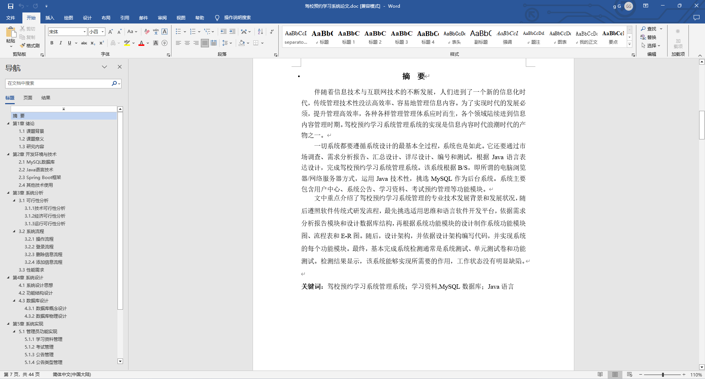
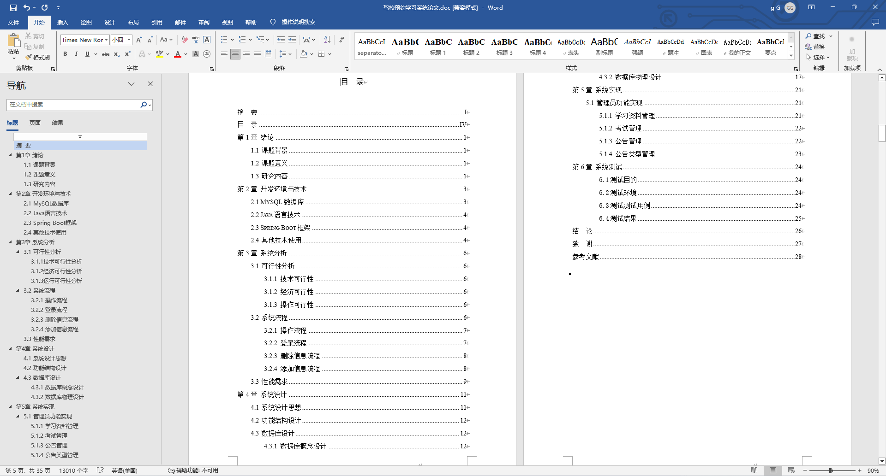
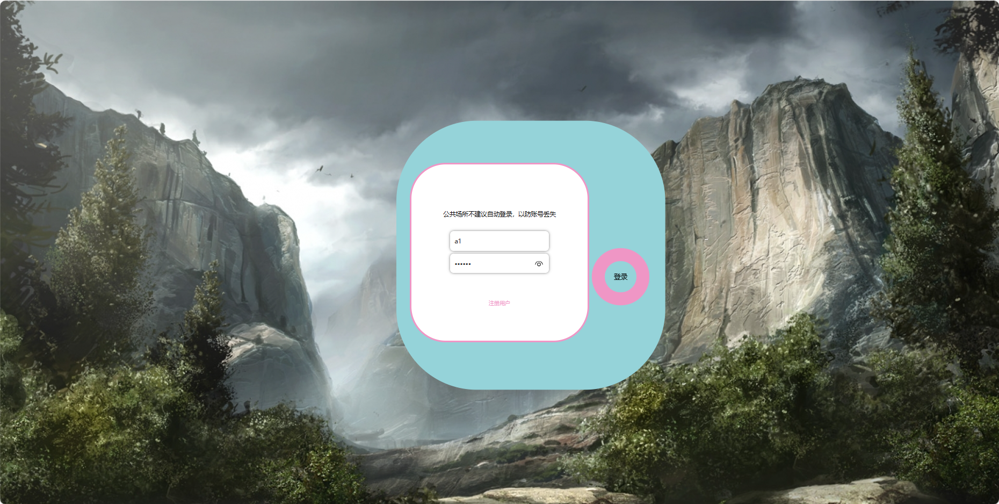
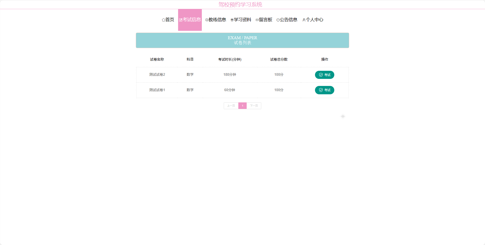
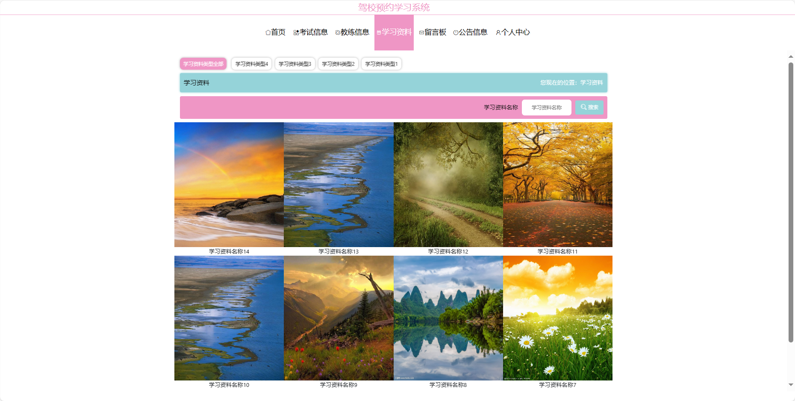
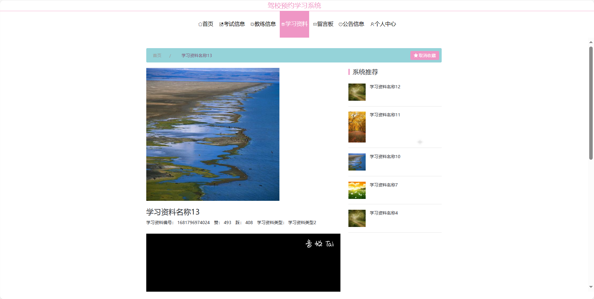
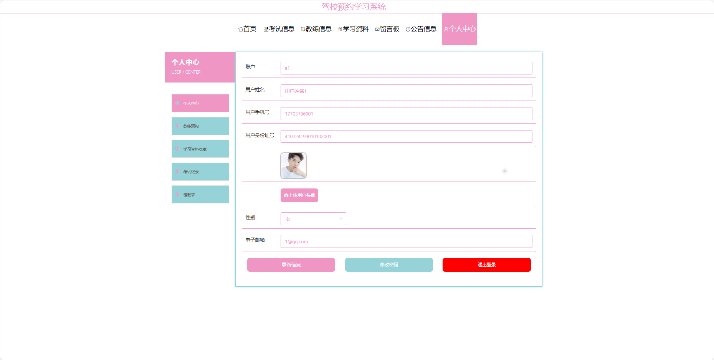

基于Springboot的驾校预约学习系统（程序+论文）
=
### 完整代码获取地址：从戎源码网 ([https://armycodes.com/](https://armycodes.com/))
### 作者微信：19941326836  QQ：952045282 
### 承接计算机毕业设计、Java毕业设计、Python毕业设计、深度学习、机器学习
### 选题+开题报告+任务书+程序定制+安装调试+论文+答辩ppt 一条龙服务
### 所有选题地址https://github.com/nature924/allProject

一、项目介绍
---
基于Spring Boot框架实现的驾校预约学习系统，系统包含三种角色：管理员、学员,教练主要功能如下。

### 【学员功能】

1. **首页：** 获取最新的学车信息
2. **考试信息：** 查看个人的考试信息和安排。
3. **教练信息：** 查看教练的相关信息和排班。
4. **学习资料：** 获取学车所需的学习资料。
5. **留言板：** 与其他学员和教练进行留言和交流。
6. **公告信息：** 浏览驾校发布的公告信息。
7. **个人中心：** 管理个人信息，包括修改密码、等。

### 【管理员功能】

1. **首页：** 查看整体系统。
2. **个人中心：** 修改密码和管理个人信息。
3. **管理员管理：** 管理系统中的管理员账号。
4. **教练管理：** 管理驾校的教练信息。
5. **用户管理：** 管理学员的账号信息。
6. **公告信息管理：** 发布和管理驾校的公告信息。
7. **教练预约管理：** 管理学员对教练的预约请求。
8. **留言板管理：** 管理留言板上的留言信息。
9. **学习资料管理：** 管理学员学习所需的资料。
10. **试卷管理：** 管理生成的试卷，包括添加和编辑。
11. **试题管理：** 管理试卷中的试题，包括添加和编辑。
12. **考试管理：** 查看学员的考试记录和错题本。
13. **基础数据管理：** 管理系统的基础数据。
14. **轮播图信息：** 管理系统首页的轮播图。

### 【教练功能】

1. **首页：** 查看驾校信息。
2. **个人中心：** 修改密码和管理个人信息。
3. **公告信息管理：** 发布和管理驾校的公告信息。
4. **教练预约管理：** 查看和管理学员对教练的预约请求。
5. **留言板管理：** 管理留言板上的留言信息。
6. **学习资料管理：** 管理学员学习所需的资料。
7. **试卷管理：** 管理生成的试卷。
8. **试题管理：** 管理试卷中的试题。

二、项目技术
---
- 编程语言：Java
- 数据库：MySQL
- 项目管理工具：Maven
- 前端技术：VUE、HTML、Jquery、Bootstrap
- 后端技术：Spring、SpringMVC、MyBatis

三、运行环境
---
- 操作系统：Windows、macOS都可以
- JDK版本：JDK1.8以上都可以
- 开发工具：IDEA、Ecplise、Myecplise都可以
- 数据库: MySQL5.7以上都可以
- Tomcat：任意版本都可以
- Maven：任意版本都可以

四、运行截图
---
### 论文截图：

### 程序截图：

